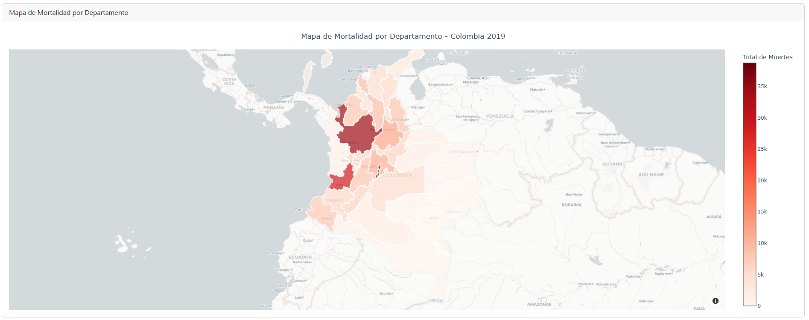
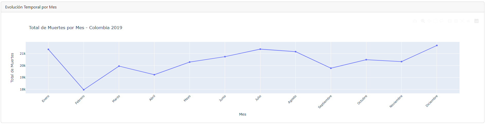
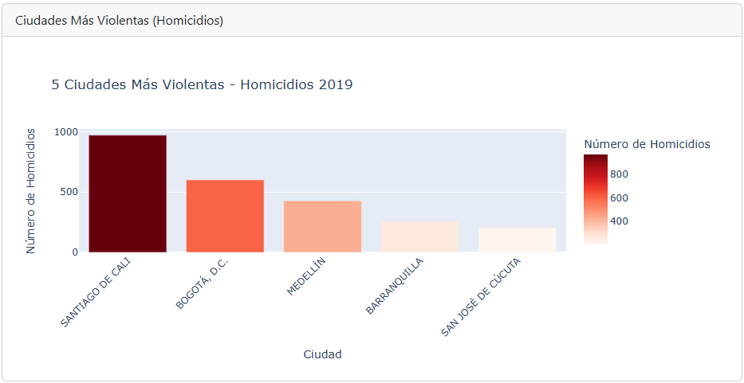
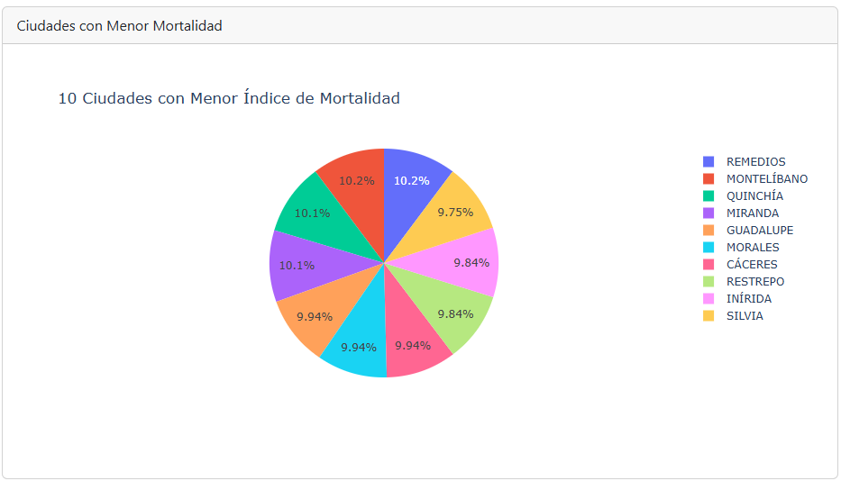
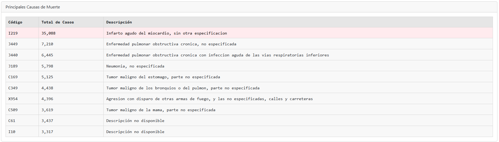
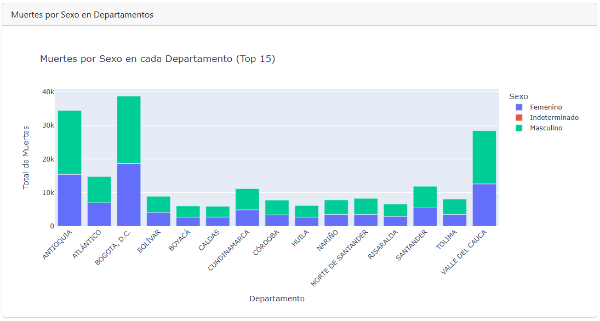
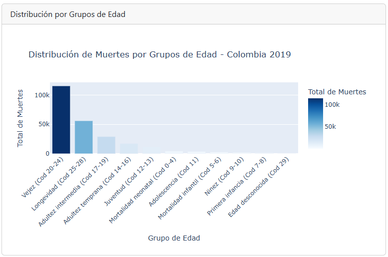

# Análisis de Mortalidad en Colombia 2019

## Introducción del Proyecto

Aplicación web interactiva desarrollada con Python, Plotly y Dash para analizar los datos de mortalidad en Colombia durante el año 2019. La aplicación permite visualizar y explorar de manera interactiva más de 244,000 registros de defunciones no fetales, proporcionando insights sobre las principales causas de muerte, distribución geográfica, tendencias temporales y análisis demográficos. Los datos utilizados provienen de fuentes oficiales del DANE (Departamento Administrativo Nacional de Estadística).

## Objetivo

La aplicación busca analizar y visualizar los patrones de mortalidad en Colombia durante el año 2019, permitiendo:

- Identificar las principales causas de muerte según códigos CIE-10
- Visualizar la distribución geográfica de la mortalidad por departamentos
- Analizar tendencias temporales de mortalidad a lo largo del año
- Comparar índices de violencia entre ciudades
- Examinar la distribución de muertes por sexo y grupos etarios
- Proporcionar una herramienta interactiva para la exploración de datos de salud pública

## Estructura del Proyecto

```
Mortalidad2019/
├── Data/                          # Datos del proyecto
│   ├── Anexo1.NoFetal2019_CE_15-03-23.xlsx    # Datos de mortalidad (244,355 registros)
│   ├── Anexo2.CodigosDeMuerte_CE_15-03-23.xlsx # Códigos CIE-10 de causas de muerte
│   ├── Divipola_CE_.xlsx                       # División política de Colombia
│   └── map.geojson                             # Geometrías de departamentos
├── app.py                         # Aplicación principal Dash
├── app_optimized.py              # Versión optimizada de la aplicación
├── data_processing.py            # Funciones de procesamiento y visualizaciones
├── data_exploration.py           # Exploración inicial de datos
├── requirements.txt              # Dependencias del proyecto
├── runtime.txt                   # Versión de Python para despliegue
├── Procfile                      # Configuración para despliegue
├── DEPLOY.md                     # Documentación de despliegue
└── README.md                     # Documentación del proyecto
```

### Descripción de archivos principales:

- **app.py**: Contiene la aplicación principal de Dash con todas las visualizaciones y el layout de la interfaz web.
- **data_processing.py**: Módulo con funciones para cargar, procesar datos y generar las visualizaciones (mapas, gráficos, tablas).
- **data_exploration.py**: Script para exploración inicial y análisis de los datos crudos.
- **requirements.txt**: Lista de todas las librerías necesarias con sus versiones específicas.
- **Procfile**: Configuración para el servidor web Gunicorn en producción.
- **runtime.txt**: Especifica la versión de Python (3.9.18) para el entorno de despliegue.

## Requisitos

### Librerías y versiones necesarias:

```
dash==2.17.1                      # Framework para aplicaciones web interactivas
plotly==5.17.0                    # Librería de visualizaciones interactivas
pandas==2.1.4                     # Manipulación y análisis de datos
openpyxl==3.1.2                   # Lectura de archivos Excel
dash-bootstrap-components==1.5.0  # Componentes de Bootstrap para Dash
numpy==1.26.2                     # Computación numérica
kaleido==0.2.1                    # Exportación de imágenes de gráficos
gunicorn==21.2.0                  # Servidor WSGI para producción
```

### Requisitos del sistema:

- Python 3.9 o superior
- pip (gestor de paquetes de Python)
- Aproximadamente 500MB de RAM disponible para procesamiento de datos
- Navegador web moderno (Chrome, Firefox, Edge, Safari)

## Software

### Herramientas y tecnologías utilizadas:

- **Python 3.9.18**: Lenguaje de programación principal
- **Dash 2.17**: Framework web para aplicaciones analíticas interactivas
- **Plotly 5.17**: Librería de visualizaciones dinámicas y gráficos interactivos
- **Pandas 2.1**: Manipulación y análisis de datos tabulares
- **Bootstrap**: Framework CSS para diseño responsivo de la interfaz
- **Gunicorn**: Servidor HTTP WSGI para aplicaciones Python en producción
- **Render.com**: Plataforma como servicio (PaaS) para despliegue web
- **Git/GitHub**: Control de versiones y repositorio del código

## Instalación

### Pasos para clonar el repositorio y ejecutar la aplicación localmente:

1. **Clonar el repositorio:**
   ```bash
   git clone https://github.com/juanpablogd/Mortalidad2019.git
   cd Mortalidad2019
   ```

2. **Crear entorno virtual:**
   ```bash
   python -m venv .venv
   ```

3. **Activar entorno virtual:**
   - Windows: 
     ```bash
     .venv\Scripts\activate
     ```
   - macOS/Linux: 
     ```bash
     source .venv/bin/activate
     ```

4. **Instalar dependencias:**
   ```bash
   pip install -r requirements.txt
   ```

5. **Ejecutar la aplicación:**
   ```bash
   python app.py
   ```

6. **Acceder a la aplicación:**
   
   Abrir el navegador web y navegar a: `http://127.0.0.1:8050`

### Notas sobre la ejecución local:

- La primera carga puede tardar 30-60 segundos debido al procesamiento de 244,355 registros
- Asegúrese de que el puerto 8050 esté disponible
- Los datos se cargan automáticamente desde la carpeta Data/

## Despliegue en Render

La aplicación ha sido desplegada en Render.com, una plataforma como servicio (PaaS) que permite el despliegue automático de aplicaciones web.

**URL de la aplicación desplegada:** https://mortalidad2019.onrender.com/

### Pasos seguidos para el despliegue:

1. **Preparación del repositorio:**
   - Crear archivo `Procfile` con el comando: `web: gunicorn app:server`
   - Crear archivo `runtime.txt` especificando: `python-3.9.18`
   - Asegurar que `requirements.txt` contenga todas las dependencias
   - Configurar variable de entorno PORT en el código de la aplicación

2. **Configuración en Render.com:**
   - Crear cuenta en Render.com y conectar con GitHub
   - Seleccionar "New Web Service"
   - Conectar el repositorio: `juanpablogd/Mortalidad2019`
   - Configurar las siguientes opciones:
     - **Name:** mortalidad2019
     - **Environment:** Python 3
     - **Build Command:** `pip install -r requirements.txt`
     - **Start Command:** `gunicorn app:server`
     - **Instance Type:** Free

3. **Despliegue:**
   - Render automáticamente construye y despliega la aplicación
   - El proceso de build toma aproximadamente 3-5 minutos
   - La aplicación queda disponible en la URL proporcionada por Render

4. **Configuración de puerto:**
   - La aplicación utiliza la variable de entorno PORT asignada por Render
   - Configuración en el código: `port = int(os.environ.get('PORT', 8050))`

### Problemas resueltos durante el despliegue:

- **Compatibilidad de Python:** pandas 2.1.4 requiere Python ≥3.9, se actualizó runtime.txt
- **Detección de puerto:** Se configuró el uso de la variable PORT de Render
- **Start Command:** Se especificó correctamente `gunicorn app:server`

Para más detalles técnicos del despliegue, consultar el archivo `DEPLOY.md`

## Visualizaciones con Explicaciones de los Resultados

La aplicación presenta 7 visualizaciones interactivas que permiten explorar diferentes aspectos de la mortalidad en Colombia durante 2019:

### 1. Mapa de Mortalidad por Departamento



**Descripción:** Mapa coroplético interactivo de Colombia que muestra la distribución de muertes por departamento.

**Hallazgos principales:**
- **Bogotá D.C.** registra el mayor número de muertes con **38,760 casos**
- **Antioquia** ocupa el segundo lugar con **34,473 casos**
- **Valle del Cauca** tiene **28,443 casos**
- La concentración de mortalidad es mayor en los departamentos más poblados
- 32 de 33 departamentos tienen datos visualizados en el mapa

**Interpretación:** La concentración de muertes en las grandes ciudades refleja principalmente la densidad poblacional. Bogotá, Antioquia y Valle del Cauca concentran aproximadamente el 41% del total de defunciones del país.

### 2. Evolución Mensual de la Mortalidad



**Descripción:** Gráfico de líneas que muestra la tendencia temporal de muertes a lo largo de los 12 meses del año 2019.

**Hallazgos principales:**
- **Diciembre** presenta el pico más alto con **21,678 muertes**
- **Julio** también muestra un pico significativo con **21,372 muertes**
- **Febrero** registra el menor número con **17,974 muertes**
- Se observa un patrón de mayor mortalidad en meses de inicio y fin de año

**Interpretación:** Los picos en diciembre y julio pueden estar relacionados con períodos vacacionales y condiciones climáticas. Febrero, el mes más corto, naturalmente presenta menos casos.

### 3. Top 5 Ciudades Más Violentas



**Descripción:** Gráfico de barras horizontales mostrando las 5 ciudades con mayor número de homicidios (códigos CIE-10: X95, X954).

**Hallazgos principales:**
1. **Santiago de Cali:** 971 homicidios
2. **Bogotá D.C.:** 601 homicidios
3. **Medellín:** 428 homicidios
4. **Barranquilla:** 260 homicidios
5. **San José de Cúcuta:** 206 homicidios

**Total de homicidios analizados:** 9,273 casos a nivel nacional

**Interpretación:** Cali lidera las estadísticas de violencia con casi 1,000 homicidios, seguida por Bogotá y Medellín. Estas tres ciudades principales concentran el 21.6% de todos los homicidios del país.

### 4. Top 10 Ciudades con Menor Mortalidad



**Descripción:** Gráfico de barras mostrando las 10 ciudades con menor índice de mortalidad (mínimo 100 casos).

**Hallazgos principales:**
- Ciudades intermedias y capitales departamentales pequeñas presentan menor mortalidad
- Rango entre 100 y 105 muertes totales
- Incluye municipios como Silvia, Inírida, Restrepo, entre otros

**Interpretación:** Estos municipios, con menor densidad poblacional, presentan índices de mortalidad más bajos, reflejando la correlación entre tamaño poblacional y número absoluto de defunciones.

### 5. Principales Causas de Muerte



**Descripción:** Tabla interactiva con las 10 principales causas de muerte según códigos CIE-10.

**Hallazgos principales:**
1. **Infarto agudo del miocardio (I219):** 35,088 casos - 14.4% del total
2. **EPOC no especificada (J449):** 7,210 casos
3. **EPOC con infección respiratoria (J440):** 6,445 casos
4. **Neumonía no especificada (J189):** 5,798 casos
5. **Tumor maligno del estómago (C169):** 5,125 casos

**Interpretación:** Las enfermedades cardiovasculares lideran como causa de muerte, seguidas por enfermedades respiratorias crónicas. Los tumores malignos también representan una proporción significativa. El infarto agudo del miocardio por sí solo representa más del 14% de todas las muertes registradas.

### 6. Análisis por Sexo y Departamento



**Descripción:** Gráfico de barras agrupadas comparando la distribución de muertes por sexo en los principales departamentos.

**Hallazgos principales:**
- En todos los departamentos, la mortalidad masculina es mayor que la femenina
- **Bogotá D.C.:** 20,058 hombres vs 18,679 mujeres
- **Antioquia:** 18,978 hombres vs 15,481 mujeres
- La brecha de género es consistente en todos los departamentos analizados

**Interpretación:** Los hombres presentan una mortalidad aproximadamente 10-20% mayor que las mujeres en todos los departamentos. Esto puede estar relacionado con factores como mayor exposición a riesgos laborales, violencia y enfermedades cardiovasculares.

### 7. Distribución por Grupos de Edad



**Descripción:** Histograma mostrando la distribución de muertes según grupos etarios definidos por el DANE.

**Hallazgos principales:**
- **Vejez (60-84 años):** 115,453 casos - 47.3% del total
- **Longevidad (85+ años):** 56,061 casos - 22.9%
- **Adultez intermedia (45-59 años):** 29,105 casos - 11.9%
- Los grupos de mayor edad concentran casi el 70% de las muertes

**Interpretación:** La distribución etaria muestra que la mortalidad se concentra significativamente en población de edad avanzada (60+ años), lo cual es consistente con patrones epidemiológicos esperados. Los grupos más jóvenes (0-18 años) representan menos del 5% del total de defunciones.

## Fuentes de Datos
- Dataset: Estadísticas Vitales - EEVV 2019
- Cobertura: Colombia, año 2019
- Registros: 244,355 defunciones no fetales

## Principales Hallazgos

## Fuentes de Datos

- **DANE:** Departamento Administrativo Nacional de Estadística de Colombia
- **Dataset:** Estadísticas Vitales - EEVV 2019
- **Cobertura:** Colombia, año 2019
- **Total de registros:** 244,355 defunciones no fetales
- **Tipo de datos:** Datos públicos de salud pública
- **Códigos de clasificación:** CIE-10 (Clasificación Internacional de Enfermedades, 10ª revisión)

## Resumen de Hallazgos

### Datos más relevantes:
- **Departamento con más muertes:** Bogotá D.C. (38,760 casos)
- **Mes con mayor mortalidad:** Diciembre (21,678 casos)
- **Principal causa de muerte:** Infarto agudo del miocardio (35,088 casos - 14.4%)
- **Ciudad más violenta:** Santiago de Cali (971 homicidios)
- **Grupo etario más afectado:** Vejez 60-84 años (115,453 casos - 47.3%)
- **Total de homicidios analizados:** 9,273 casos a nivel nacional

### Códigos CIE-10 utilizados para homicidios:
- **X95:** Agresión con disparo de armas de fuego
- **X954:** Agresión con disparo de otras armas de fuego

## Metodología

### Procesamiento de datos:
1. Carga de archivos Excel con pandas
2. Limpieza y validación de datos
3. Merge de tablas por códigos geográficos (DIVIPOLA)
4. Clasificación de grupos etarios según estándares DANE
5. Generación de visualizaciones interactivas con Plotly

### Clasificación de grupos de edad DANE:
- Mortalidad neonatal: 0-4 años
- Mortalidad infantil: 5-6 años
- Primera infancia: 7-8 años
- Niñez: 9-10 años
- Adolescencia: 11 años
- Juventud: 12-13 años
- Adultez temprana: 14-16 años
- Adultez intermedia: 17-19 años
- Vejez: 20-24 años (60-84 años)
- Longevidad: 25-28 años (85+ años)

## Información del Proyecto

**Universidad:** Universidad de La Salle  
**Programa:** Maestría en Inteligencia Artificial  
**Materia:** Aplicaciones I  
**Cohorte:** 2025-II  
**Tipo:** Trabajo académico - Análisis de datos de salud pública

---

**Repositorio:** https://github.com/juanpablogd/Mortalidad2019  
**Aplicación desplegada:** https://mortalidad2019.onrender.com/
